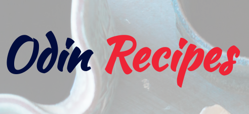

  

# Odin Recipes

## Table of Contents

  - [:baguette_bread: Initial structure ](#baguette_bread-initial-structure-)
  - [:plate_with_cutlery: Recipe page ](#plate_with_cutlery-recipe-page-)
  - [:page_facing_up: Page content ](#page_facing_up-page-content-)
  - [:cook: More recipes ](#cook-more-recipes-)

## :baguette_bread: Initial structure 

- Within the odin-recipes directory, create an index.html file.
- Fill it out with the usual boilerplate HTML and add an h1 heading “Odin Recipes” to the body.
## :plate_with_cutlery: Recipe page 

- Create a new directory within the odin-recipes directory and name it recipes.
- Create a new HTML file within the recipes directory and name it after the recipe it will contain. For example lasagna.html. You can use the name of your favorite dish or, if you need some inspiration, you can find a recipe to use here.
- For now, just include an h1 heading with the recipe’s name as its content.
- Back in the index.html file, add a link to the recipe page you just created. The text of the link should again be the recipe name.
## :page_facing_up: Page content 

The recipe page should have the following content:

- An image of the finished dish under the h1 heading that you added earlier. You can find images of the dish on google or the site recipe site we linked to earlier.
- Under the image, it should have an appropriately sized “Description” heading followed by a paragraph or two describing the recipe.
- Under the description, add an “Ingredients” heading followed by an unordered list of the ingredients needed for the recipe.
- Finally, under the ingredients list, add a “Steps” heading followed by an ordered list of the steps needed for making the dish.

## :cook: More recipes 

- Add two more recipes with identical page structures to the recipe page you’ve already created.
- Don’t forget to link to the new recipes on the index page. Also, consider putting all the links in an unordered list so they aren’t all on one line.
